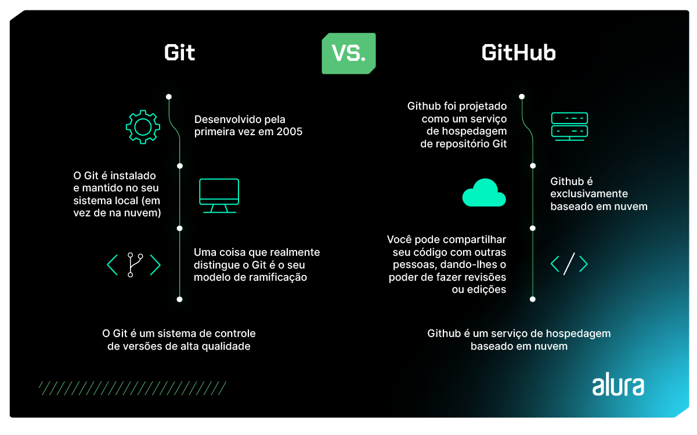

# Formação Iniciante em Programação 
## 1. HTML e CSS: Ambientes de desenvolvimento, estruturas de arquivos e tags
## 2. HTML e CSS: Classes, posicionamento e flexbox
## 3. HTML e CSS: Cabeçalho, footer e variáveis CSS
## 4. HTML e CSS: Trabalhando com responsabilidade e publicação de projetos 
## 5. Git e Github 
### Diferenças 
O **Github** é uma “rede social dev” em que é possível armazenar e compartilhar projetos de desenvolvimento de software.

O **Git** é um sistema de controle de versão de arquivos; em outras palavras, é responsável por guardar o histórico de alterações sempre que alguém modificar algum arquivo que está sendo monitorado por ele.



### Conceitos fundamentais do Git 
- **Repositório**: é como uma pasta ou diretório que contém todos os arquivos e o histórico de um projeto
- **commit**: ação que você faz em um projeto que se compromete e salva suas alterações no histórico do projeto. Ou seja, um commit é uma entrada no histórico que contêm informações sobre as alterações feitas. 
- **Árvores**: representam a estrutura do diretório e arquivos em um commit específico, que tem como função registrar a organização do projeto ao longo do histórico de desenvolvimento. 
- **Ramificações**: ramificações ou **branches** permitem que você crie linhas separadas de desenvolvimento para trabalhar em recursos ou correções sem afetar a linha principal do projeto. Cada branch é uma ramificação independente do código-fonte, possibilitando que você isole e desenvolva novas funcionalidades, refatore o código ou faça correções e testes em paralelo, sem interferir no código existente na branch principal, que geralmente é nomeada como "main".
- **merge**: Em um projeto com branches diferentes, a fusão, ou **merge**, permite combinar as alterações dessas branches de volta à linha principal, quando as alterações estão prontas.

### Principais comandos do Git
- **git init**: É utilizado para inicializar um repositório Git dentro de um diretório do sistema. Após sua utilização, a ferramenta passa a monitorar o estado dos arquivos no projeto.
- **git clone**: É utilizado para **criar uma cópia de um repositório remoto em um diretório da máquina**. Este repositório poder ser criado a partir de um repositório armazenado localmente, através do caminho absoluto ou relativo, ou pode ser remoto, através do URI na rede.
- **git status**: É utilizado para verificar o status de um repositório git, bem como o estado do repositório central. O comando mostra informações sobre se o projeto local está sincronizado com o central, quais arquivos estão sendo monitorados pelo Git e em qual branch você está no projeto.
- **git add** : É utilizado para adicionar arquivos ao pacote de alterações a serem feitas. É possível adicionar um único arquivo, múltiplos arquivos de uma vez, como **git add <-arquivo1-> <-arquivo2-> ...**, ou até mesmo um diretório, a partir de seu caminho. Uma vez que um arquivo é adicionado ao pacote de alterações com o comando add, ele está pronto para entrar no próximo commit.
- **git commit**: 
```js
git commit -m "mensagem do commit"
```

É utilizado para criar uma nova versão do projeto a partir de um pacote de alterações. O commit pega o pacote de modificações adicionado através do comando git add, fecha essas alterações num pacote e o identifica através de um Hashcode.

Além disso, para cada commit é necessário escrever uma mensagem para identificá-lo, com uma mensagem clara de quais alterações foram feitas neste commit.

- **git log**: 
```
git log
```

É utilizado para ver o histórico de alterações do projeto, onde aparecerão todos os commits feitos, com suas respectivas mensagens e códigos identificadores.

O comando é muito útil quando precisamos rastrear o andamento de um projeto e verificar em qual ponto cada funcionalidade foi implementada.

Além disso, o comando conta com várias opções para mostrar o histórico de forma resumida, gráfica e até mesmo mostrando a diferença entre os commits, que podem ser vistas na documentação oficial do comando.

- **git branch**: É utilizado para ver o histórico de alterações do projeto, onde aparecerão todos os commits feitos, com suas respectivas mensagens e códigos identificadores.

O comando é muito útil quando precisamos rastrear o andamento de um projeto e verificar em qual ponto cada funcionalidade foi implementada.

Além disso, o comando conta com várias opções para mostrar o histórico de forma resumida, gráfica e até mesmo mostrando a diferença entre os commits, que podem ser vistas na documentação oficial do comando.

- **git checkout**: 

É utilizado para navegar entre as versões do projeto, bem como entre as diferentes ramificações criadas. Para navegar entre as versões, basta usar o comando:

```js
git checkout <- Hashcode do commit ->
```

```js
git checkout <- nome da branch ->
```

E a branch será alterada. O comando também permite criar uma branch e imediatamente mudar para ela, através do comando:

```js
git checkout -b <- nome da branch ->
```

Para mais informações, temos o seguinte artigo na Alura: [Comparativo Git e Github](https://www.alura.com.br/artigos/o-que-e-git-github) e [Iniciando repositório git](https://www.alura.com.br/artigos/iniciando-repositorio-git). 

### Lista de comandos básicos mais utilizados ao trabalhar com versionamento em Git 

- **git config**: Este é o primeiro comando a ser executado após instalar o Git. Ele possibilita configurar seu nome e endereço de email que ficará vinculado às alterações.

```js
git config --global user.name "Nome do usuário"
git config --global user.email "seu@email.com"
```

- **git init**: Inicia ou cria um repositório.
```js
git init
````

- **git status**: Permite visualizar o estado do repositório.

```js
git status
```
git add: Prepara o conteúdo para o próximo commit.
$ git add nome_do_arquivo
$ git add .
git commit: Salva o conteúdo atual junto com uma mensagem de registro do usuário que descreve as alterações.
$ git commit -m "Mensagem descritiva do commit"
git clone: Clona um repositório existente.
$ git clone [url]
git branch: Uma branch nada mais é do que uma ramificação dentro do repositório. Este comando pode ser utilizado de diversas maneiras.
$ git branch // Mostra as branches existentes em um repositório
$ git branch nome_da_branch // Cria uma nova branch
$ git branch -M nome_da_branch // Renomeia a branch atual
git log: Exibe um histórico de commits. Este comando pode ser utilizado de diversas formas.
$ git log
$ git log --oneline
git remote: Exibe o repositório remoto.
$ git remote
$ git remote -v
git pull: Baixa o conteúdo do repositório remoto, atualizando automaticamente o repositório local.
$ git pull
git push: Envia o conteúdo do repositório local, atualizando automaticamente o repositório remoto.
$ git push
